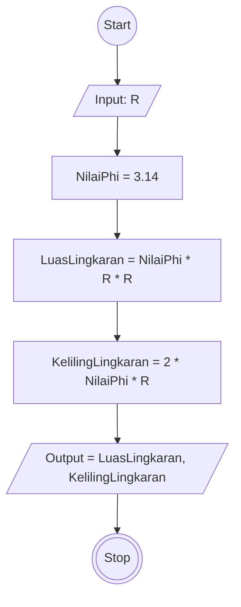

# Algoritma JavaScript1

## Task 1

```mermaid
flowchart TD
idStart((Start))
idInput[/"Input: R"/]
idNilaiPhi["NilaiPhi = 3.14"]
idLuasLingkaran["LuasLingkaran = NilaiPhi * R * R"]
idKelilingLingkaran["KelilingLingkaran = 2 * NilaiPhi * R"]
idHasil[/"Output = LuasLingkaran, KelilingLingkaran"/]
idStop(((Stop)))

idStart --> idInput --> idNilaiPhi --> idLuasLingkaran --> idKelilingLingkaran --> idHasil --> idStop

```