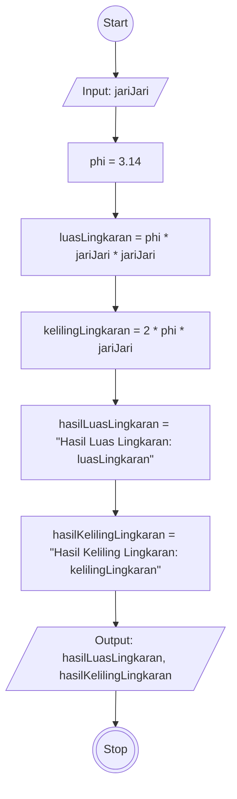

# Algoritma JavaScript1

## Task 1

```mermaid
flowchart TD
idStart((Start))
idInput[/"Input: jariJari"/]
idNilaiPhi["phi = 3.14"]
idLuasLingkaran["luasLingkaran = phi * jariJari * jariJari"]
idKelilingLingkaran["kelilingLingkaran = 2 * phi * jariJari"]
idProsesLuas[hasilLuasLingkaran = #quot;Hasil Luas Lingkaran: luasLingkaran#quot;]
idProsesKeliling[hasilKelilingLingkaran = #quot;Hasil Keliling Lingkaran: kelilingLingkaran#quot;]
idOutput[/Output: hasilLuasLingkaran, hasilKelilingLingkaran/]
idFinish(((Stop)))

idStart --> idInput --> idNilaiPhi --> idLuasLingkaran --> idKelilingLingkaran --> idProsesLuas --> idProsesKeliling --> idOutput --> idFinish
```