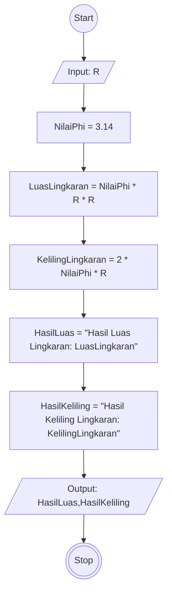

# Algoritma JavaScript1

## Task 1

```mermaid
flowchart TD
idStart((Start))
idInput[/"Input: R"/]
idNilaiPhi["NilaiPhi = 3.14"]
idLuasLingkaran["LuasLingkaran = NilaiPhi * R * R"]
idKelilingLingkaran["KelilingLingkaran = 2 * NilaiPhi * R"]
idProsesLuas[HasilLuas = #quot;Hasil Luas Lingkaran: LuasLingkaran#quot;]
idProsesKeliling[HasilKeliling = #quot;Hasil Keliling Lingkaran: KelilingLingkaran#quot;]
idOutput[/Output: HasilLuas,HasilKeliling/]
idFinish(((Stop)))

idStart --> idInput --> idNilaiPhi --> idLuasLingkaran --> idKelilingLingkaran --> idProsesLuas --> idProsesKeliling --> idOutput --> idFinish
```