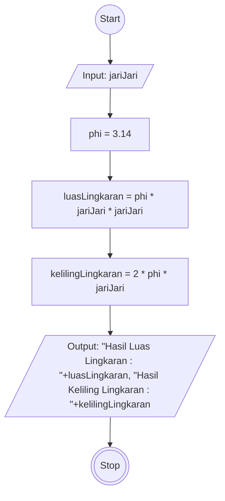

# Algoritma JavaScript1

## Task 1

```mermaid
flowchart TD
idStart((Start))
idInput[/"Input: jariJari"/]
idNilaiPhi["phi = 3.14"]
idLuasLingkaran["luasLingkaran = phi * jariJari * jariJari"]
idKelilingLingkaran["kelilingLingkaran = 2 * phi * jariJari"]
idOutput[/Output: "Hasil Luas Lingkaran : "+luasLingkaran, "Hasil Keliling Lingkaran : "+kelilingLingkaran/]
idFinish(((Stop)))

idStart --> idInput --> idNilaiPhi --> idLuasLingkaran --> idKelilingLingkaran -->  idOutput --> idFinish
```