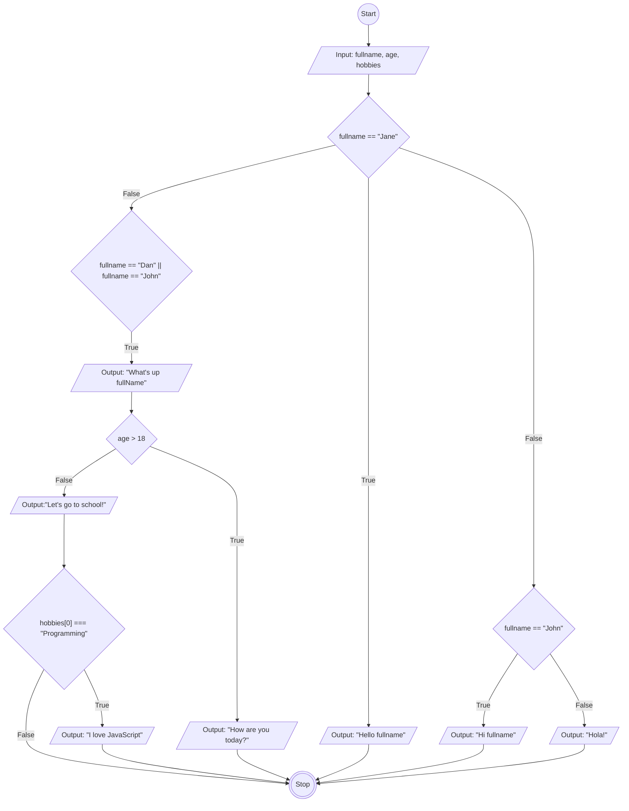

```mermaid
flowchart TD
idStart((Start))
idInput[/"Input: fullname, age, hobbies"/]
idKondisi1{"fullname == #quot;Jane#quot;"}
idKondisi1True[/Output: "Hello fullname"/]
idKondisi1False{"fullname == #quot;Dan#quot; || fullname == #quot;John#quot;" }
idKondisi1FalseJawabTrue[/"Output: #quot;What's up fullName#quot;"/]
idKondisi1FalseJawabFalse{fullname == #quot;John#quot;}
idKondisi2{age > 18}
idKondisi2True[/"Output: #quot;How are you today?#quot;"/]
idKondisi2False[/"Output:#quot;Let's go to school!#quot;"/]
idKondisi3{"hobbies[0] === #quot;Programming#quot;"}
idKondisi3True[/"Output: #quot;I love JavaScript#quot;"/]
idStop(((Stop)))
idKondisi4True[/"Output: #quot;Hi fullname#quot;"/]
idKondisi4False[/Output: #quot;Hola!#quot;/]


idStart --> idInput --> idKondisi1
idKondisi1 -- True --> idKondisi1True
idKondisi1 -- False --> idKondisi1False
idKondisi1False -- True --> idKondisi1FalseJawabTrue
idKondisi1 -- False --> idKondisi1FalseJawabFalse
idKondisi1FalseJawabFalse -- True --> idKondisi4True
idKondisi1FalseJawabFalse -- False --> idKondisi4False
idKondisi1FalseJawabTrue --> idKondisi2
idKondisi2 -- True --> idKondisi2True
idKondisi2 -- False --> idKondisi2False
idKondisi2False ---> idKondisi3
idKondisi3 -- True --> idKondisi3True
idKondisi3 -- False --> idStop
idKondisi3True --> idStop
idKondisi2True --> idStop
idKondisi1True --> idStop
idKondisi4True --> idStop
idKondisi4False --> idStop
```