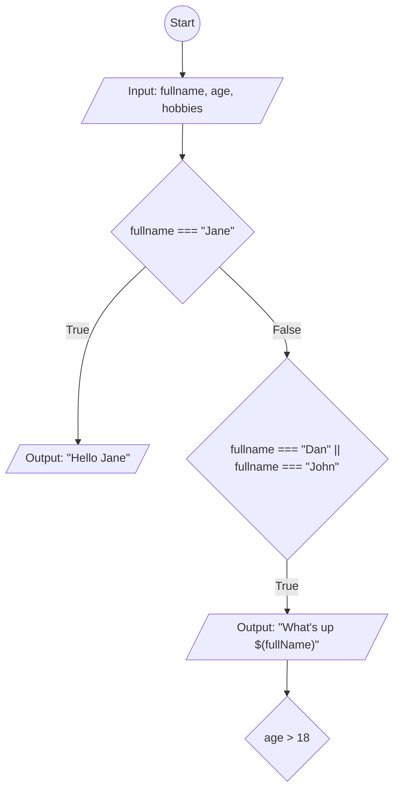

```mermaid
flowchart TD
idStart((Start))
idInput[/"Input: fullname, age, hobbies"/]
idKondisi1{"fullname === #quot;Jane#quot;"}
idKondisi1True[/Output: "Hello Jane"/]
idKondisi1False{"fullname === #quot;Dan#quot; || fullname === #quot;John#quot;" }
idKondisi1FalseJawabTrue[/"Output: #quot;What's up $(fullName)#quot;"/]
idKondisi2{age > 18}


idStart --> idInput --> idKondisi1
idKondisi1 -- True --> idKondisi1True
idKondisi1 -- False --> idKondisi1False
idKondisi1False -- True --> idKondisi1FalseJawabTrue
idKondisi1FalseJawabTrue --> idKondisi2

```