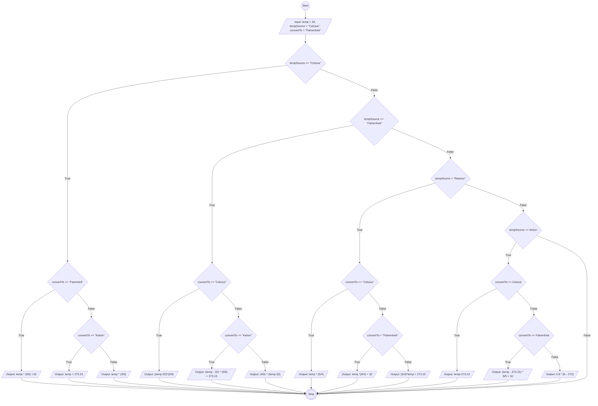

```mermaid
flowchart TD
idStart((Start))
idInput[/Input: temp = 34, tempSource = #quot;Celcius#quot;, convertTo = #quot;Fahrenheit#quot;/]
ifConvertTo{tempSource == #quot;Celcius#quot;}
ifConvertToTrue{convertTo == #quot;Farenheit#quot; }
hitunganCelciusFahrenheit[/"Output: temp * (9/5) +32"/]
ifConvertToFalse{convertTo == #quot;Kelvin#quot;}
hitunganCelciusKelvin[/"Output: temp + 273.15"/]
convertToReamurTrue[/"Output: temp * (4/5)"/]

idConvertFahrenheit{tempSource == #quot;Fahrenheit#quot;}
convertFahrenheitCelcius{convertTo == #quot;Celcius#quot;}
hasilFahrenheitCelcius[/"Output: (temp-32)*(5/9)"/]
convertFahrenheitKelvin{convertTo == #quot;Kelvin#quot;}
convertFahrenheitKelvinTrue[/"Output: (temp - 32) * (5/9) + 273.15"/]
convertFahrenheitKelvinFalse[/"Output: (4/9) * (temp-32)"/]

asalReamur{tempSource = #quot;Reamur#quot;}
convertToCelciusReamur{convertTo == #quot;Celcius#quot;}
convertToReamurCelciusTrue[/"Output: temp * (5/4)"/]
convertToReamaurCelciusFalse{convertTo = #quot;Fahrenheit#quot;}
convertReamurFahrenheit[/"Output: temp *(9/4) + 32"/]
convertReamurKelvin[/"Output: (5/4)*temp + 273.15"/]

convertKelvin{tempSource == Kelvin}
convertIsItCelcius{convertTo == Celcius}
convertKelvinCelcius[/"Output: temp-273.15"/]
convertIsItFahrenheit{convertTo == Fahrenheit}
convertKelvinFahrenheit[/"Output: (temp - 273.15) * 9/5 + 32"/]
convertKelvinReamur[/"Output: 0.8 * (K - 273)"/]

idStop(((Stop)))

idStart --> idInput --> ifConvertTo
ifConvertTo -- True --> ifConvertToTrue
ifConvertTo -- False --> idConvertFahrenheit

ifConvertToTrue -- True --> hitunganCelciusFahrenheit
ifConvertToTrue -- False --> ifConvertToFalse
ifConvertToFalse -- True --> hitunganCelciusKelvin
ifConvertToFalse -- False --> convertToReamurTrue

idConvertFahrenheit -- True --> convertFahrenheitCelcius
idConvertFahrenheit -- False --> asalReamur
convertFahrenheitCelcius -- True --> hasilFahrenheitCelcius
convertFahrenheitCelcius -- False --> convertFahrenheitKelvin
convertFahrenheitKelvin -- True --> convertFahrenheitKelvinTrue
convertFahrenheitKelvin -- False --> convertFahrenheitKelvinFalse

asalReamur -- True --> convertToCelciusReamur
asalReamur -- False -->convertKelvin
convertToCelciusReamur -- True --> convertToReamurCelciusTrue
convertToCelciusReamur -- False --> convertToReamaurCelciusFalse
convertToReamaurCelciusFalse -- True --> convertReamurFahrenheit
convertToReamaurCelciusFalse -- False --> convertReamurKelvin

convertKelvin -- True --> convertIsItCelcius
convertKelvin -- False --> idStop
convertIsItCelcius -- True --> convertKelvinCelcius
convertIsItCelcius -- False --> convertIsItFahrenheit
convertIsItFahrenheit -- True --> convertKelvinFahrenheit
convertIsItFahrenheit -- False --> convertKelvinReamur

hitunganCelciusFahrenheit --> idStop
hitunganCelciusKelvin --> idStop
convertToReamurTrue --> idStop
hasilFahrenheitCelcius --> idStop
convertFahrenheitKelvinTrue --> idStop
convertFahrenheitKelvinFalse --> idStop
convertToReamurCelciusTrue --> idStop
convertReamurFahrenheit --> idStop
convertReamurKelvin --> idStop
convertKelvinCelcius --> idStop
convertKelvinFahrenheit --> idStop
convertKelvinReamur --> idStop
```