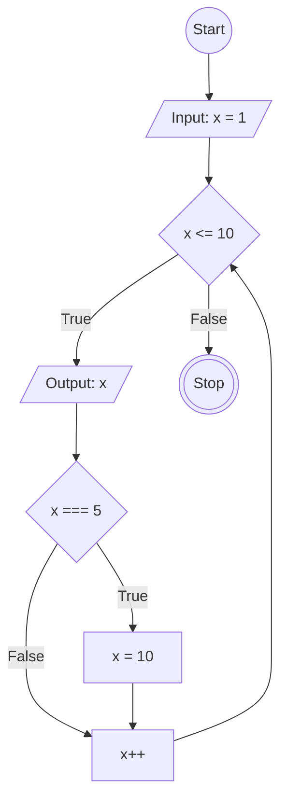
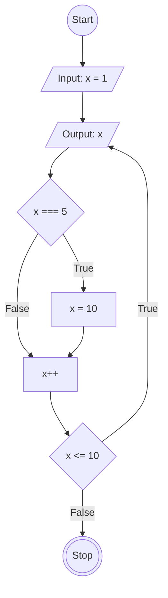

```mermaid
flowchart TD
idStart((Start))
idInisialisasi[/Input: x = 1/]
idKondisi{x <= 10}
idProses[/Output: x/]
idKondisi2{x === 5}
idKondisi2True[x = 10]
idKondisi2False[x++]
idStop(((Stop)))

idStart --> idInisialisasi --> idKondisi
idKondisi -- True --> idProses --> idKondisi2
idKondisi -- False --> idStop
idKondisi2 -- True --> idKondisi2True
idKondisi2 -- False --> idKondisi2False
idKondisi2False --> idKondisi
idKondisi2True --> idKondisi2False
```

## Do While Loop Flowchart

```mermaid
flowchart TD
idStart((Start))
idInisialisasi[/Input: x = 1/]
idKondisi{x <= 10}
idProses[/Output: x/]
idKondisi2{x === 5}
idKondisi2True[x = 10]
idKondisi2False[x++]
idStop(((Stop)))

idStart --> idInisialisasi --> idProses --> idKondisi2 
idKondisi2 -- True --> idKondisi2True
idKondisi2 -- False --> idKondisi2False
idKondisi2True --> idKondisi2False
idKondisi2False --> idKondisi
idKondisi -- True --> idProses
idKondisi -- False --> idStop
```