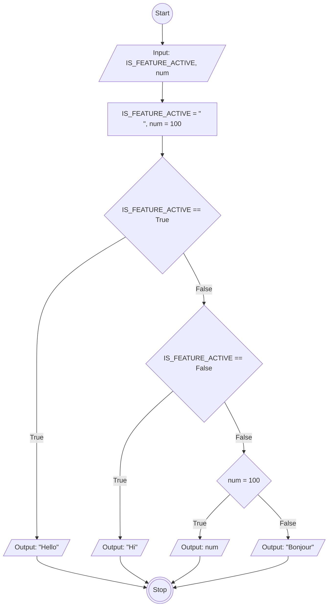

```mermaid
flowchart TD
idStart((Start))
idInput[/Input: IS_FEATURE_ACTIVE, num/]
idProcess[IS_FEATURE_ACTIVE = #quot; #quot;, num = 100]
idSwitch{IS_FEATURE_ACTIVE == True}
idOutputTrue[/Output: #quot;Hello#quot;/]
idKondisiFalse{IS_FEATURE_ACTIVE == False}
idOutputFalse[/Output: #quot;Hi#quot;/]
kondisiDefault{num = 100}
kondisiDefaultTrue[/Output: num/]
kondisiDefaultFalse[/Output: #quot;Bonjour#quot;/]
idStop(((Stop)))

idStart --> idInput --> idProcess --> idSwitch
idSwitch -- True --> idOutputTrue --> idStop
idSwitch -- False --> idKondisiFalse 
idKondisiFalse -- True --> idOutputFalse --> idStop
idKondisiFalse -- False --> kondisiDefault
kondisiDefault -- True --> kondisiDefaultTrue --> idStop
kondisiDefault -- False --> kondisiDefaultFalse --> idStop
```