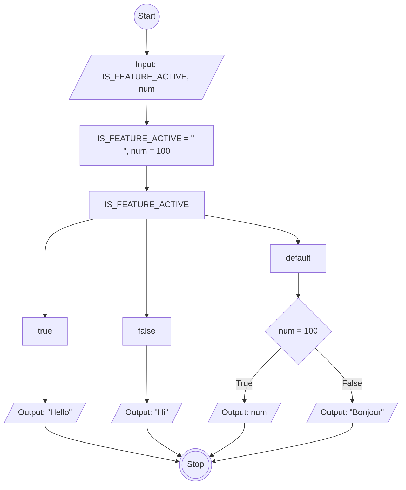

```mermaid
flowchart TD
idStart((Start))
idInput[/Input: IS_FEATURE_ACTIVE, num/]
idProcess[IS_FEATURE_ACTIVE = #quot; #quot;, num = 100]
idSwitch[IS_FEATURE_ACTIVE]
idCaseTrue[true]
idOutputTrue[/Output: #quot;Hello#quot;/]
idCaseFalse[false]
idOutputFalse[/Output: #quot;Hi#quot;/]
idDefault[default]
kondisiDefault{num = 100}
kondisiDefaultTrue[/Output: num/]
kondisiDefaultFalse[/Output: #quot;Bonjour#quot;/]
idStop(((Stop)))

idStart --> idInput --> idProcess --> idSwitch
idSwitch --> idCaseTrue --> idOutputTrue --> idStop
idSwitch --> idCaseFalse --> idOutputFalse --> idStop
idSwitch --> idDefault --> kondisiDefault
kondisiDefault -- True --> kondisiDefaultTrue --> idStop
kondisiDefault -- False --> kondisiDefaultFalse --> idStop
```